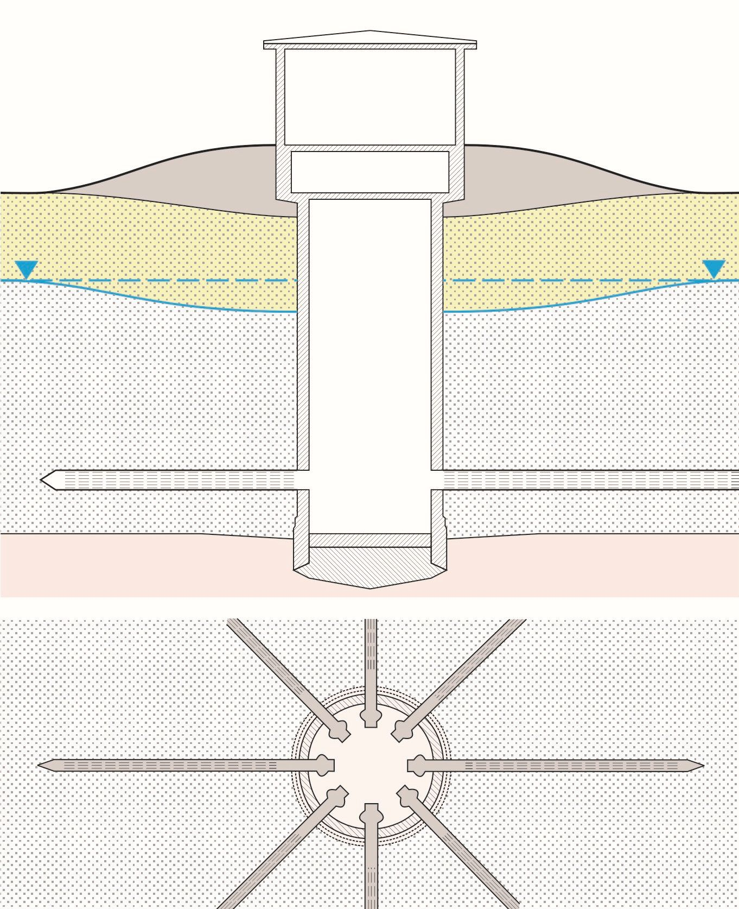
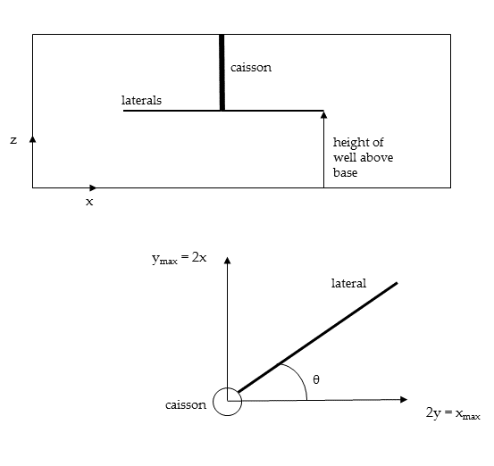

# HORI: Software for horizontal and radial collector wells

Collins, S. and Houben, G. (2019). Horizontal and radial collector wells: simple tools for a complex problem. *Hydrogeology Journal*.

  

## Installation

HORI requires that the MATLAB Runtime version 9.0.1 (R2016a) is installed ([see Mathworks](https://uk.mathworks.com/products/compiler/matlab-runtime.html)). Running the file *MyAppInstaller_web.exe* will install both HORI and the MATLAB runtime installer on to your computer. If you already have MATLAB runtime installed, you can instead run *HORI.exe* straightaway.    

## Radial collector well

  

* The equation of Hantush and Papadopulos (1962) (HP in interface) or Williams (2013)
can be used to calculate drawdown around a well in a confined or unconfined aquifer.
* Setting the “z coordinate” to -1 will give the 2D solution of the Hantush and
Papadopulos (1962)
* Any units can be used as long as they are consistent.
* The tool places the well at the centre of the grid (xmax/2, ymax/2)
* Enter the lengths and angles of all of the laterals into the respective boxes with a space
in between each value
* If the first few metres of the laterals are not screened, the caisson radius can be adjusted
accordingly.
* If the tool is running slowly reduce the size of the grid or increase the grid square size.

## Slant well

* The tool uses the method of Williams (2013) with the Cooper and Jacob (1946) equation for transient flow in a confined aquifer. If the “maximum drawdown” is greater than 15% of the aquifer thickness, the equation is no longer valid for an unconfined aquifer and the “maximum drawdown” is shown in red.
* The “number of point sinks ” is the number of sinks used to represent each lateral.

## References
Cooper, H.H. and Jacob, C.E. (1946). A generalized graphical method for evaluating formation constants and
summarizing well field history. *American Geophysical Union Transactions* 27: 526 534.

Hantush, M.S. and Papadopulos , I.S. (1962). Flow of ground water to collector wells. *Proc Am Soc Civil Eng, J Hydraulics
Div HY5*: 221-224.

Williams, D. (2013). Drawdown distribution in the vicinity of nonverticalwells. *Groundwater* 51:745-751.
